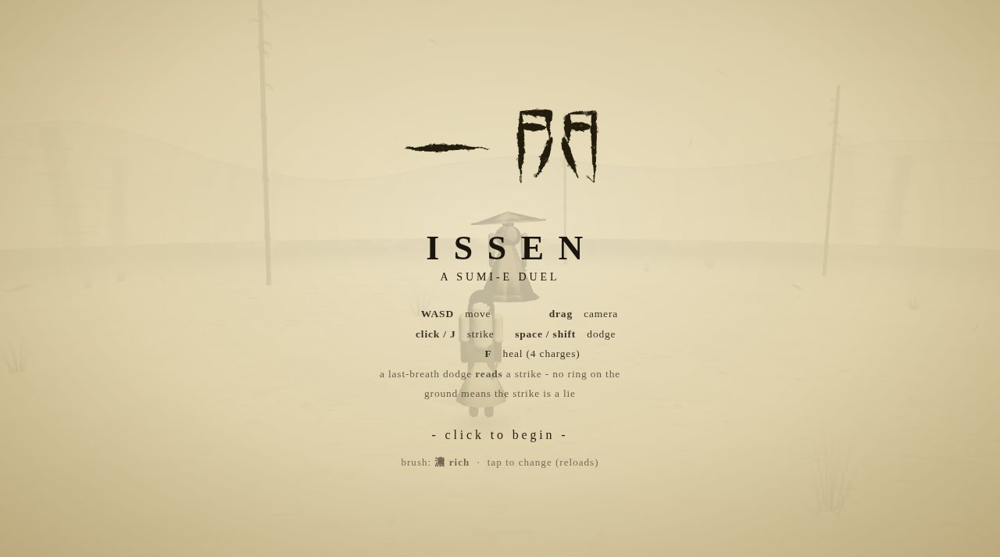

# ISSEN 一閃

A sumi-e sword duel in the browser. One fighter, one ronin, ink on paper.



**Live:** https://aeiouvcode.github.io/issen/

## About

ISSEN is a third-person duel rendered as a living ink painting. Figures are brushed onto a paper ground, strikes leave slash arcs, and a dodge leaves a ghost behind. The boss changes pattern at half health and some of his strikes are feints: a real strike always shows a ring on the ground first.

## Controls

| Action | Keyboard / mouse | Touch |
| --- | --- | --- |
| Move | WASD | Left thumb |
| Camera | Drag | Right side of screen |
| Strike | Click or J | 斬 |
| Dodge | Space or Shift | 避 |
| Heal (4 charges) | F | 気 |

A last-breath dodge reads the incoming strike. The brush setting on the title screen switches ink density.

## Built with

- Three.js r160 loaded as an ES module from jsDelivr (import map with SRI)
- Custom ink shaders for figures, ground grain and mist
- Web Audio for sound, no audio files
- One `index.html`, no build step, no network calls after load

## Run locally

```sh
git clone https://github.com/aeiouvcode/issen.git
cd issen
python3 -m http.server 8000
```

Then open http://localhost:8000.

An internet connection is needed on first load for the Three.js module.

## Layout

```
index.html        the whole game: markup, styles, shaders and logic
docs/             README assets
```
